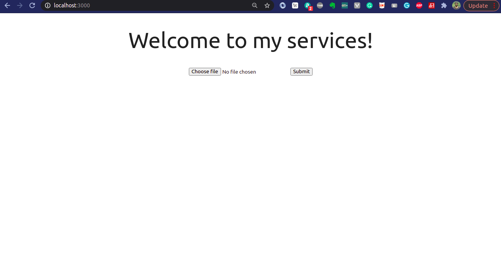

# SIT725 Applied Software Engineering Prac 2

## About 
In this practical session, we tried to create a basic nodejs application that launches as server and hosts a simple webpage.

In this demo, I've created a POST method that lets user upload a file (data) to the server. It does not save the file on the server yet. This is just to demonstrate the successful running of a nodejs server. 

**This work is a small step towards building a consulting website (portfolio website) for myself.**


## Stack


## Run the application

```
$ npm install
$ node server.js
```

## Output



## License

[](http://badges.mit-license.org)

